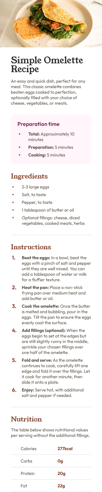

# Frontend Mentor - Recipe page solution

This is a solution to the [Recipe page challenge on Frontend Mentor](https://www.frontendmentor.io/challenges/recipe-page-KiTsR8QQKm). Frontend Mentor challenges help you improve your coding skills by building realistic projects. 

## Table of contents

- [Overview](#overview)
  - [The challenge](#the-challenge)
  - [Screenshot](#screenshot)
  - [Links](#links)
- [My process](#my-process)
  - [Built with](#built-with)

## Overview

### The challenge

- Create a recipe page with a custom pseudo-element for list items.
- Ensure responsive design between desktop and mobile views.

### Screenshot

#### Desktop

#### Mobile

### Links

- Solution URL: [Solution URL here](https://paikai-lee.github.io/recipe_page/)

## My process

### Built with

- Semantic HTML5 markup
- CSS custom properties
- CSS BEM naming
- Flexbox for layout and alignment.
- Responsive Web Design (RWD) to ensure compatibility across devices.